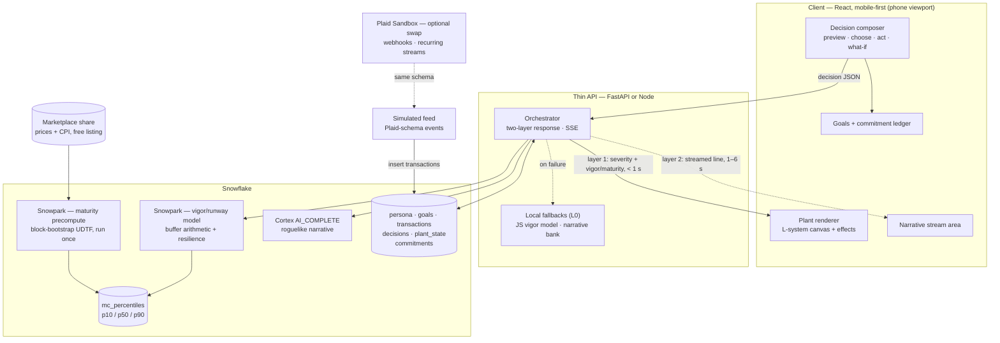
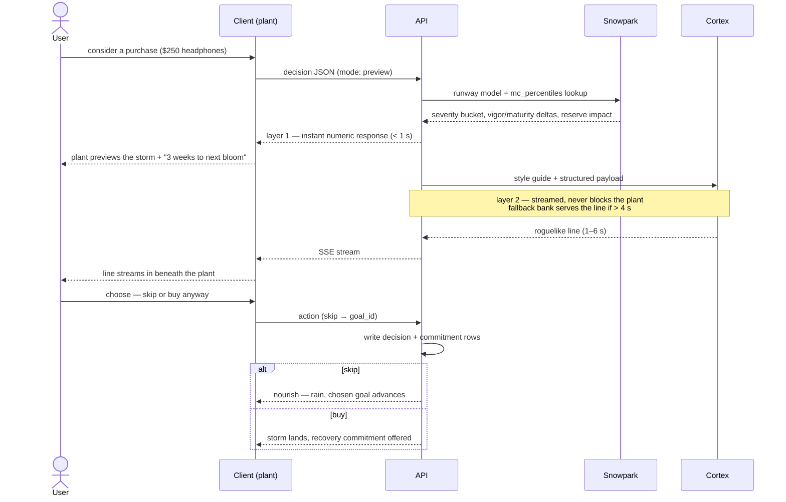

# Dew — the plant that shows you your future
### Master project document · 12-hour hackathon · supersedes the Sprout draft
Repo: github.com/nathanzezhao/Dew · Team notes reconciled: INDEX.md (all items preserved or explicitly mapped — see §19/§20)

---

## TL;DR — the pitch

**Dew is a living plant that *is* your financial future — built for a first-year student living on their own for the first time, and it reacts before you spend, not after.**

The hackathon problem says people make everyday financial decisions "without clearly understanding how those decisions may affect them later." Every other team will read that as an information gap and build a dashboard. It isn't an information gap — it's a *perception* gap, and nobody lives inside it more than a first-year who just became financially independent: no felt intuition yet, a budget measured in tens of dollars, a buffer measured in weeks, and every spending habit of their adult life forming *right now*. The number that matters lives years away and feels like it belongs to a stranger. Dew moves it into today and gives it a heartbeat.

Instead of a chart, you tend a plant. It grows through real stages as your trajectory over your degree improves — grounded in a market simulation running in Snowflake on real historical data. When you're *considering* a purchase, the plant previews the weather that decision would bring: $250 headphones summon a hailstorm, a $15 impulse buy a passing frost, a new food-delivery membership a colony of aphids that quietly settles in and saps your vigor until you cancel — at which point they crawl away. Your **water reserve** shows your resilience: if your part-time job fell through today, how many weeks of drought could your plant survive? A roguelike narrator voices every consequence ("*Your plant weathers an arduous storm of hail. Its leaves are torn, and time will be needed to recover.*") — generated by Claude inside Snowflake Cortex, with severity always decided by the simulation, never the LLM. And every consequence ends in an action: skip the purchase and the money is captured toward one of your three goals as rain soaks the soil; buy anyway and the storm lands, followed by a recovery commitment you can accept on the spot.

The plant never dies. Damage lands instantly but is *felt over time* — lingering, then healing. Growth only ratchets up. Rent and groceries never storm it; only discretionary choices get weather. Fear-based finance apps get deleted; something you cultivate gets opened — and Dew is the morning water on a young plant.

The win condition isn't engagement. It's that one day at the campus bookstore you pause — because you can already feel the storm coming — and you never opened the app at all.

**Stack:** React mobile client (canvas L-system plant, zero art assets) · thin API · Snowflake engine (Snowpark runway + Marketplace-grounded Monte Carlo, Cortex/Claude narrative, tables) · simulated transaction feed speaking Plaid's schema, upgradeable to live Plaid Sandbox webhooks.

---

## 1. The problem, reframed — and the person

**Prompt:** "People make everyday financial decisions without clearly understanding how those decisions may affect them later."

**The naive reading** treats this as missing information → dashboards and calculators. **The correct reading:** "clearly understand" means *viscerally register*, not *have the number*. The future is abstract, emotionless, and disconnected from the present self — which is exactly why people discount it. Dew's job is to collapse the distance between this tap and the self who lives with it later.

### 1.1 Pivot 1 — the persona, and what each condition changes in the design

A university student living independently for the first time. Each condition from the team notes maps to a concrete design consequence:

| Condition (from INDEX) | Design consequence |
|---|---|
| **Limited budget** | Severity constants tuned to student scale (§8.1): with ~$200/mo discretionary room, a $70 purchase *is* a major event. High sensitivity is honest here, not dramatic — and it makes the plant visibly reactive, which the demo needs. |
| **Limited experience** | No jargon, no percentages, no dollar-projections in the narrative voice. Consequences arrive as weather and weeks-to-bloom, not finance-speak. |
| **Busy schedule / lack of time** | The whole loop is one screen and three taps, under 10 seconds. Actions are one-tap commitments, never forms. |
| **Unfamiliar environment** | Essentials (rent, groceries, transit, phone) are weather-neutral — first-time independence must not be punished for existing. |
| **Need for simple, practical decisions** | Preview shows exactly one concrete unit ("sets your next bloom back ~3 weeks") and two buttons. No option paralysis. |
| **Cost of living** | The **resilience score / water reserve** (§3.4): drought endurance answers the question that actually keeps students up at night — "if my income stopped, how long do I last?" |
| **Independence** | Dew trains intuition rather than replacing it — the endgame is not needing the app at the checkout. |

**Pitch bonus:** the judges' room is full of people who *were* this persona. Say so.

---

## 2. Evidence base — why this design and not another

A commissioned research review drove every major choice. Findings, with honest caveats:

**What reliably works:**
- **Action mechanisms beat everything.** Save More Tomorrow (Thaler & Benartzi, *JPE* 2004) raised savings rates 3.5% → 13.6% over 40 months via pre-commitment and automation — the field's strongest result. (Caveat: DoL's CLEAR review rates the original's causal quality "low"; effect widely accepted in spirit.) → **Every emotional beat ends in a captured action.**
- **Salience at the point of decision.** Explicitly naming opportunity cost cut purchase willingness 75% → 55% (Frederick et al. 2009; 73% → 37% in study 2). 2023 meta-analysis (39 studies, N≈14,000): pooled d≈0.22 — real, modest.
- **Temporal reframing.** "$5/day" vs. "$150/month" roughly quadrupled enrollment (~7% → ~30%) among ~9,000 real Acorns users (Hershfield, Shu & Benartzi 2020) and erased the income gap in take-up. → Dew's *concrete unit* speaks in the plant's timeline, not dollars.
- **Episodic future thinking** reduces delay discounting (fragile, demand-prone, but supported).

**What works less than its fame suggests:**
- **Future-self visualization:** lab-supported but a 2025 systematic review calls interventions "mixed"; MIT's "Future You" chatbot (preregistered, N=344) reduced anxiety and raised future-self continuity while measuring **zero financial outcomes**, immediate effects only. → The plant is the front-end, never the whole product.
- **The "latte factor":** vivid, analytically weak (big levers are housing/income; deprivation → frugal fatigue). Dew keeps the *visibility* reframing, drops the moralizing.

**Backfire modes, designed against:**
- **Ostrich effect** (threatening salience → avoidance, deleted apps) → plant recovers, never dies, growth ratchets.
- **Learned helplessness** (consequence without action → paralysis) → one-tap action after every beat.
- **False precision** (misread Monte Carlo "success probabilities"; falsely precise point forecasts) → uncertainty is sky ambiance; outcomes are plant-timeline units; **no number in the narrative voice, ever.**
- **Guilt for essentials** → weather-neutral by rule.

**Honesty guardrail (memorize):** the *mechanisms* are the best-evidenced in the literature; "one app durably changes behavior" is a harder claim. If pressed: *"The levers we pull are the ones with the best evidence; proving durable change takes a longitudinal study we can't run in twelve hours."* Never invent a statistic; never cite app-marketing numbers.

---

## 3. The concept

### 3.1 The plant, on two axes

| Axis | Meaning | Behavior | Driven by |
|---|---|---|---|
| **Maturity** (growth) | Trajectory over the degree (~4-year horizon) | Permanent; ratchets up; sets growth stage (sprout → seedling → young → maturing) | Marketplace-grounded projection + savings trajectory (§8.2) |
| **Vigor** (health) | Short-term condition | Transient; shocked by decisions; recovers toward a baseline over days | Runway / cash-flow model (§8.1) |

The split implements the team note "big purchases won't be felt instantly, rather over a period of time" *without* giving up point-of-decision salience: the weather **hits at the decision** (the evidence lever), and the **damage is felt over time** — vigor stays depressed through a recovery window, pests drain continuously, growth stalls while wounds close. Instant signal, prolonged consequence.

### 3.2 Weather, pests, and the metaphor dictionary

| Financial event | Metaphor | Transient or persistent |
|---|---|---|
| Major discretionary hit | Hailstorm / snowstorm, gale, lightning | Transient (lingers, then recovers) |
| Moderate hit | Cold snap, dry wind | Transient |
| Minor hit | A nip of frost | Transient |
| Recurring drain (subscription) | Aphids / pests; escalating vine when stacked | **Persistent** until cancelled; also lowers the recovery *baseline* |
| Skip / save | Rain, sun, rich soil, new shoots | Nourishing |
| Windfall | Bloom | Nourishing |
| Essential (rent, groceries, transit) | *No weather at all* | Neutral |
| Uncertainty (p10–p90 width) | Stormy vs. calm sky ambiance | Ambient |
| Income shock ("what if I lost my job") | **Drought** | What-if scenario |

The transient/persistent split in the visuals mirrors the same split in the mechanic — that alignment is why the metaphor reads as true.

### 3.3 The gain track — three goals (team note, adopted wholesale)

"Cannot be loss only." Exactly **three goal slots** — short, mid, long term:

| Slot | Student example | Horizon |
|---|---|---|
| Short | Reading-week trip, concert tickets | weeks–months |
| Mid | Next term's sublet deposit, a laptop | this year |
| Long | Graduate with a real buffer / minimal debt | the degree |

Skipping a purchase captures the amount and **the user picks which goal it expedites**; the system offers a recommended split by default (e.g., weighted toward the nearest underfunded goal), per the note "system can recommend portion of saving." Goal progress is what the concrete unit speaks in: "3 weeks closer to the trip."

### 3.4 Resilience score → drought endurance (team note, upgraded from "iffy")

The note: *"temp job lost — with my savings I can survive for this amount of time."* This is already computed: it is `runway = buffer / burn` from the vigor model. Zero new math; one new visual: the plant's **water reserve** (soil moisture ring). Home screen line: *"Your plant can weather about 6 weeks of drought."* The what-if mode extends it: simulate income stopping → the sky dries, the reserve drains forward in time, and the display shows what discretionary spending would need to drop to, and when — exactly the note's scenario, rendered as weather instead of a spreadsheet. This is the single most persona-resonant feature in the app.

### 3.5 The roguelike voice
Second person, plant-as-you, 1–2 sentences, names the recovery when transient, never mentions money, dollars, or percentages.
- Major: *"Your plant weathers an arduous storm of hail. Its leaves are torn, and time will be needed to recover."*
- Minor: *"A brief frost nips the youngest leaves. A small setback, soon shrugged off."*
- Pest: *"A colony of aphids settles in — barely felt now, but they quietly sap your vigor day by day."*
- Cancel: *"The last aphid is brushed away. The sap runs clean again."*
- Nourish: *"A gentle rain soaks the soil. New shoots stir beneath the surface."*
- Drought (what-if): *"The rains have stopped. Your reserve will hold for six weeks — after that, the plant must learn to live on less."*

Severity comes from the simulation, never the LLM. **A pizza never gets lightning.**

### 3.6 Non-negotiable design rules
1. **Pre-decision is primary** — the plant reacts to a purchase being *considered* ("what-if mode" in the team notes). The feed is secondary.
2. **Every consequence ends in an action** (skip→goal capture, buy→recovery commitment, pest→cancel, drought→adjustment plan).
3. **The plant never dies**; damage lingers, then heals; growth never reverses.
4. **Essentials are weather-neutral.**
5. **Proportional severity, from the sim.**
6. **No dollar figures or percentages in the narrative.** The plant's appearance *is* the health bar; numeric readouts stay ambient.

---

## 4. The core loop

```
consider a purchase  →  PREVIEW  (plant shows the weather this would bring
                                  + "sets your next bloom back ~3 weeks"
                                  + reserve impact if material)
                     →  CHOOSE   (skip / buy anyway)
                     →  ACT      (skip: amount captured to a chosen goal, rain
                                  buy: storm lands → recovery commitment offered)
```

Under 30 seconds on stage. Everything else serves this loop. The what-if drought scenario is the same loop with `mode: whatif` and an income shock instead of a purchase.

---

## 5. Architecture

**Three layers, one seam.** The engine hands the client exactly two numbers plus a severity bucket — `vigor` and `maturity` (plus the reserve readout). The plant renderer consumes those and nothing else; front-end and engine tracks meet only at this contract (§7).





Cylinders = data at rest; dotted arrows = non-blocking or optional paths.

---

## 6. Data model (Snowflake tables)

```sql
persona        (user_id, monthly_income, essentials_monthly, savings_target_monthly,
                liquid_buffer, horizon_months)                 -- horizon ≈ degree length, ~48

goals          (goal_id, user_id, term, name, amount, progress) -- term: short | mid | long; exactly 3 rows

transactions   (txn_id, user_id, ts, amount, category, merchant,
                is_recurring, is_essential, source)             -- source: manual | simulated | plaid_sandbox

decisions      (decision_id, user_id, ts, amount, category, is_recurring, is_essential,
                severity_bucket, vigor_delta, maturity_delta, choice)   -- choice: skip | buy | pending

plant_state    (user_id, vigor, baseline, maturity, reserve_weeks, pests_json, last_event_ts)

commitments    (commitment_id, user_id, ts, kind, amount, goal_id, status)
               -- kind: divert_to_goal | skip_n_discretionary | cancel_subscription

mc_percentiles (horizon_month, p10_growth, p50_growth, p90_growth)   -- precomputed once (§8.2)
```

**Demo persona seed (student-scale; adjust freely, keep the proportions):** income $1,600/mo (part-time + support), essentials $1,250 (rent share $750, groceries $280, phone/transit $220), savings target $150, **discretionary room ≈ $200/mo**, buffer $1,900 → burn ≈ $1,430/mo → **reserve ≈ 5–6 weeks**. Goals: short "Reading-week trip" $400 (progress $120) · mid "Sublet deposit" $900 ($150) · long "Graduate with a buffer" $5,000 ($480).

---

## 7. API contracts

### 7.1 Decision request (client → API)
```json
{ "user_id": "demo-1", "amount": 250, "category": "electronics", "merchant": "Best Buy",
  "is_recurring": false, "is_essential": false, "mode": "preview" }
```
`mode`: `preview` | `commit` | `skip` | `whatif` (income-shock scenario: payload carries `income_delta` instead of a purchase).

### 7.2 Instant response — layer 1 (API → client, target < 1 s)
```json
{
  "severity_bucket": "major", "direction": "damaging",
  "vigor_before": 72, "vigor_after": 49, "vigor_delta": -23, "baseline": 72,
  "maturity_before": 41, "maturity_after": 40,
  "reserve_weeks_before": 5.7, "reserve_weeks_after": 4.9,
  "months_to_goal_delta": 0.7, "goal_ref": "short",
  "concrete_unit": "sets your next bloom back about 3 weeks",
  "recovery_days": 9,
  "effects": { "storm": 1.0, "wind": 1.1, "rain": 0, "cold": 0, "drought": 0, "pests_delta": 0 }
}
```
The client sets plant targets from `effects` and `vigor_after` **immediately** — it never waits for layer 2.

### 7.3 Narrative — layer 2 (API → client, SSE)
```
data: Your plant weathers an arduous storm of hail.
data:  Its leaves are torn, and time will be needed to recover.
event: done
```
Cortex > ~4 s or error → fallback-bank line in the identical event shape; the client can't tell.

### 7.4 Action (client → API)
```json
{ "user_id": "demo-1", "decision_id": "d-102", "action": "skip", "goal_id": "g-short" }
{ "user_id": "demo-1", "decision_id": "d-102", "action": "buy",
  "recovery": { "kind": "skip_n_discretionary", "n": 2 } }
{ "user_id": "demo-1", "action": "cancel_subscription", "merchant": "DashPass" }
```
`skip` → commitment row (`divert_to_goal`, chosen or recommended `goal_id`), goal progress up, nourish. `buy` → transaction written, storm lands, accepted recovery doubles the vigor recovery rate for its duration. `cancel_subscription` → pests removed, baseline restored.

---

## 8. Engine models

### 8.1 Vigor — runway / cash-flow model (sensitive, transient) + resilience
The correction that shaped the engine: **a $60 purchase is noise against a multi-year Monte Carlo** — deriving plant events from the p50 (as the raw team note suggested) leaves the plant inert on everyday decisions. Events come from the near-term buffer; the p50 drives growth (§8.2). Runs in Snowpark; identical copy in client JS as the L0 fallback.

```
disc_room_m   = monthly_income - essentials_monthly - savings_target_monthly     # ≈ $200 student scale
burn_m        = essentials_monthly + avg_discretionary_m
reserve_weeks = liquid_buffer / burn_m * 4.33            # ← the RESILIENCE SCORE / water reserve

# one-off discretionary purchase
impact        = amount / disc_room_m
buffer_hit    = amount / liquid_buffer
severity      = max(impact, 2 * buffer_hit)              # eating the cushion counts double

# STUDENT-SCALE buckets (retuned; at $200/mo room the old thresholds made every pizza a storm)
bucket        = minor    if severity < 0.10              # ≲ $20
                moderate if 0.10 <= severity < 0.35      # ~$20–70
                major    if severity >= 0.35             # ≳ $70
vigor_delta   = -clamp(severity * 45, 2, 30)

# rules
is_essential  -> vigor_delta = 0, bucket = neutral (no weather)
is_recurring  -> baseline -= clamp(amount_m / disc_room_m * 40, 2, 10)   # persists until cancelled
skip          -> vigor_delta = +clamp(severity * 30, 4, 12); chosen goal.progress += amount

# recovery (tick, or lazily on next load) — "felt over time"
vigor += (baseline - vigor) * r_day                      # r_day ≈ 0.12/day
accepted recovery commitment -> r_day *= 2 for its duration

# what-if drought (mode: whatif, income_delta = -monthly_income)
reserve path forward in time; output: weeks until reserve exhausted at current burn,
and the discretionary level that extends it to a target date  ("what I need to drop to, and when")
```
A handful of arithmetic lines whose job is *sensitivity to a single purchase*. Constants are persona-scale knobs — tune once against the seed persona so the five demo beats land in the intended buckets, then freeze.

### 8.2 Maturity — Marketplace-grounded degree-horizon trajectory (slow, permanent)
Horizon re-anchored from retirement to **the degree (~48 months)** toward the long-term goal.

**Precompute once (Snowpark, before the demo):**
1. Mount the free financial listing (Cybersyn *Financial & Economic Essentials* / *Snowflake Public Data (Free)*; ORGADMIN-privileged role required). Inspect the mounted schema first.
2. Daily equity prices → monthly returns series.
3. **Block bootstrap:** sample contiguous multi-month blocks from the *real* sequence — preserves fat tails and sequence risk, which is the honest reason to use real data instead of a hardcoded μ/σ.
4. N paths × 48 months via UDTF → `GROUP BY horizon_month` → `mc_percentiles`.

**Per decision (hot path = a lookup):**
```
p50_growth           = mc_percentiles[remaining_months].p50_growth
opportunity_cost     = amount * p50_growth
months_to_goal_delta = amount / savings_target_monthly
concrete_unit        = "sets your next bloom back about {round(delta*4.3)} weeks"
maturity             = f(projected savings at horizon vs. long goal)   # 0–100, slow
buy -> maturity -= small     skip+capture -> maturity += small
```
**Honest framing (use it in the pitch):** over a 4-year horizon, *contributions dominate returns* — "at your horizon, your habits outweigh the market." The Marketplace data supplies the real uncertainty band (p10–p90 → sky ambiance), not a promise. Never surface a "probability of success."

**Scale note:** at demo scale the whole simulation fits in one stored procedure with a numpy loop; use the UDTF pattern because it's the correct Snowflake-native shape, not because you need the parallelism.

### 8.3 Severity → visual effects mapping
| Bucket / event | storm | wind | rain | cold | drought | flash · shake | leaves | pests |
|---|---|---|---|---|---|---|---|---|
| neutral (essential) | 0 | idle | 0 | 0 | 0 | — | — | — |
| minor | 0 | 0.35 | 0 | 1.0 | 0 | — | 6 fall | — |
| moderate | 0.45 | 0.7 | 0 | 0 | 0 | — | 16 fall | — |
| major | 1.0 | 1.1 | 0 | 0 | 0 | yes · 9 px | 34 fall | — |
| recurring (subscription) | 0 | idle | 0 | 0 | 0 | — | — | +7 aphids, baseline ↓ |
| skip / nourish | 0 | idle | 1.0 | 0 | 0 | — | regrow | — |
| cancel subscription | 0 | idle | 0.4 | 0 | 0 | — | regrow | remove all, baseline ↑ |
| what-if drought | 0 | 0.3 | 0 | 0 | ramps with weeks | — | slow wilt | — |

Intensity scales with severity. **A pizza never gets lightning.**

---

## 9. Narrative layer (Cortex)

### 9.1 Call
`AI_COMPLETE` (SQL) simple path; Cortex inference REST endpoint when streaming tokens into SSE. Claude runs inside Cortex — sponsor usage, in-perimeter.

### 9.2 Prompt shape
Fixed style guide + per-decision payload. The LLM voices what the sim decided; it never decides severity.
```
STYLE
  second person; the plant is the user; 1–2 sentences; roguelike register.
  map financial impact to nature/weather. name the recovery when transient.
  never mention money, dollars, or percentages.

METAPHOR DICTIONARY (do not drift)
  major hit -> storm/hail/snowstorm/gale/lightning · moderate -> cold snap/dry wind
  minor -> a nip of frost · recurring drain -> aphids/pests/creeping vines/rot
  skip/save -> rain/sun/rich soil/new shoots · windfall -> bloom
  income shock (what-if) -> drought, dry season, rationed water
  essential -> (return empty; no line)

PAYLOAD
  { decision:"headphones purchase", severity:"major", direction:"damaging",
    recovery_days:9, stage:"seedling", pests_present:false, reserve_weeks:4.9 }
```

### 9.3 Fallback bank
Two–three hardcoded lines per bucket (`nourish`, `minor`, `moderate`, `major`, `pest`, `cancel`, `drought`), shipped in API and client. Served whenever Cortex exceeds ~4 s or errors. **Scripted demo decisions have lines pre-generated and cached** — the live demo never depends on a fresh model call.

---

## 10. Visual system

### 10.1 Why procedural (the no-artists answer)
The plant is *grown*, not drawn: an **L-system** generates structure from a tiny grammar + turtle renderer.
- Growth stages = rewrite iterations (2 sprout … 5 maturing) driven by maturity.
- Health = rendering parameters (color, droop, leaf density, bloom) fed by one vigor scalar — no separate damaged art.
- Same seed every frame ⇒ the same plant; only its condition changes.

**Rejected:** CC0 sprite packs (fallback only — discrete stages, health needs variants); AI-generated sprites (can't keep one plant coherent across stages).

### 10.2 Renderer spec (built; ~200 lines vanilla canvas, zero assets)
- Grammar: axiom `X`; `X → F+[[X]-X]-F[-FX]+X`, `F → FF`; turn ≈ 22° with seeded jitter; mulberry32 PRNG.
- Bounds-fit: measure pass then draw pass — always fits at any iteration/droop.
- Vigor mapping: leaf hue 120→28, sat 55→38, size shrinks; leaf-keep probability falls; stem hue 92→30; droop = sag × depth; blooms above vigor ≈ 82.
- Two-axis state: `maturity` ratchets (iterations); `vigor` eases toward `baseline` (self-healing); `baseline` drops per active subscription.
- **New for Dew:** `reserve_weeks` renders as soil-moisture ring / water level at the base; what-if drought ramps sky dryness and a slow wilt as the projected reserve drains.

### 10.3 Effects toolkit (built; same canvas, same severity input)
1. **Particles** — `{x,y,vx,vy,life,type}`: hail (ground bounce), rain (darkens soil), frost, falling leaves.
2. **Tweened parameters** — `storm/wind/rain/cold/drought` + sky each ease toward targets that decay on their own.
3. **Wind sway** — `sin(t + depth)·wind`, outer branches weighted (`depth·0.15`); idle breeze always on — a dead-still plant reads as a screenshot.
4. **Segment-attached pests** — aphids interpolate along recorded branch segments (sway with the plant), persist until cancel.
5. **Flash + shake** — white overlay = lightning; decaying random translate = impact.

Transient effects are particles with a lifetime; persistent effects are state until removed — the same shape as the mechanic.

**Polish backlog (last):** per-leaf scale-in on regrowth; escalating vine when subscriptions stack.

---

## 11. Client

### 11.1 Stack and rationale
React, mobile-first, single page. **React over Streamlit-in-Snowflake:** the two demo-winning moments — instant plant reaction, narrative streaming a beat later — need mobile UI control and the two-layer response Streamlit doesn't give. Accepted trade: we wire Snowflake via the API; the sponsor story is "Snowflake is the engine."

### 11.2 Screens
1. **Home** — plant, stage label, ambient vigor, **water reserve ring + "weathers ~6 weeks of drought"**, three goal bars.
2. **Consider** — amount, category, essential/recurring toggles → *preview*; a **what-if** tab for the income-shock drought scenario.
3. **Preview** — the weather this would bring + concrete-unit line (+ reserve impact when material) + *skip it* / *buy anyway*.
4. **Aftermath** — effect plays; roguelike line streams; if bought, recovery commitment offered.
5. **Ledger** — three goals with progress, commitments, subscriptions with *cancel* (pests leave when you do).

### 11.3 Mobile demo on a PC
Phone-sized viewport (Chrome DevTools device mode); most authentic: mirror a real phone (scrcpy Android / QuickTime iPhone). Notifications: in-app toast; skip true web-push in 12 h.

---

## 12. Input path

### 12.1 Manual entry — primary *and correct*
Pre-decision consideration ("what-if mode") is inherently manual: the user is contemplating and asks the plant.

### 12.2 Simulated feed (L4)
Scripted timestamped events inserted into `transactions`, pushed to the client via SSE toast. **Shape every event to Plaid's transaction/webhook schema** — free now, credible swap later, truthful "speaks Plaid's protocol natively" claim always.

### 12.3 Plaid Sandbox — the strong middle tier (2–3 h, only if the hour-8 gate is green)
Free, instant, *not a mock*: the real integration against fake banks. `user_transactions_dynamic` has realistic dynamic data, works with `/transactions/refresh` to trigger **real webhooks**, includes months of history for recurring streams. Upgrades the claim to "the bank integration is built and running in Plaid's sandbox."

### 12.4 Subscription detection — solved by the platform
`/transactions/recurring/get` returns recurring streams (category, merchant, amount, frequency, status). Maps 1:1 to pests: **`early_detection`** flags new streams before 3 occurrences (aphids arrive early); **habitual purchases (coffee, groceries, gas) are excluded** by Plaid's model (Plaid draws Dew's own pest-vs-weather line); **`RECURRING_TRANSACTIONS_UPDATE`** fires on stream changes (pests leave automatically when the user cancels at the source). Paid add-on in production; DIY fallback (merchant + cadence + amount) is trivial.

### 12.5 Never on stage
A live bank connection: top demo killer, security-optics red flag, and real aggregation is hours-latency anyway (§15).

---

## 13. Latency engineering

**Budgets:** manual → visible reaction ≤ 7 s (design hits ~1 s); automated feed → notification ≤ 30 s (trivial simulated; **unreachable for real aggregation regardless of code**).

| Stage | Cost | Notes |
|---|---|---|
| client → API | ~50 ms | |
| runway model | < 100 ms | pure arithmetic |
| `mc_percentiles` lookup | < 200 ms | precomputed |
| warehouse cold start | 0–3 s if idle | **pre-warm**, keep-alive |
| **Layer 1 total** | **< 1 s** | plant reacts here |
| Cortex narrative | 1–6 s | streamed, fallback at 4 s |

The rule: **the plant reacts off the numbers; the prose never blocks.** Marketplace work is "slow, once"; per-decision is arithmetic + a lookup.

---

## 14. Snowflake platform guide

### 14.1 Marketplace
Zero-copy Secure Data Sharing: *Get* a listing → live read-only shared database in your account; provider maintains it; you pay only query compute. Relevant free listing: **Cybersyn *Financial & Economic Essentials* / *Snowflake Public Data (Free)*** — daily stock prices/volumes, CPI, GDP, unemployment, unified schema. **Gotchas:** ORGADMIN-privileged role to mount; inspect actual table names before querying.

### 14.2 Snowpark
Python **on Snowflake's compute, colocated with data**: stored procedures and UD(T)Fs in a secured sandbox on the warehouse. DataFrame API (lazy → SQL pushdown) for prep; vectorized UDFs for batch numeric work (not always faster at small scale — don't chase it); **UDTF** for Monte Carlo paths (one seed row → month rows, state across rows, parallelized across sims).

### 14.3 Cortex
Managed AI from SQL: `AI_COMPLETE` + AI functions, Cortex Search, Analyst, Agents; Claude models in-perimeter. Dew uses `AI_COMPLETE` / inference REST for streaming. Transaction categorization, if ever needed, is one Cortex call — never a custom model.

### 14.4 Setup checklist (hour 0–1, Person B)
1. Trial account; ORGADMIN role confirmed.
2. Marketplace free financial listing → Get; inspect schema.
3. Create §6 tables incl. `goals`; seed the student persona.
4. Snowpark: runway proc; block-bootstrap UDTF; run `mc_percentiles` precompute (48-month horizon); verify p10 < p50 < p90.
5. Cortex: one working `AI_COMPLETE` with §9.2; cache scripted demo lines.
6. Warehouse keep-alive on a timer through judging.

---

## 15. Production roadmap (pitched, not built)

- **Bank connections:** Plaid (US) / Flinks–MX (Canadian-native coverage — relevant: this is a Canadian student product) via Link OAuth; webhooks → Snowpipe → same engine. Honest caveat: posted transactions lag the swipe by hours, so this powers the *post-hoc* layer (feed, pests), never the preview. Production access = application + paid tiers.
- **True real-time interception:** issuer-processor auth webhooks (Lithic, Marqeta, Stripe Issuing) — sub-second; roadmap only.
- **Push notifications:** PWA + FCM/APNs replaces the toast.
- **ML (parked):** decision-risk classifier (labels suggested by the BNPL constraint→late-payment literature) driving *why* the plant reacts; learned trajectory generator for the behavioral half of maturity. Snowpark ML, same tables. Never a custom transaction categorizer.

---

## 16. Fallback ladder — build in this order

| Level | Adds | If it fails |
|---|---|---|
| **L0** | All client-side: plant + loop + JS runway model + hardcoded narrative + canned maturity + reserve | — (always works) |
| **L1** | API + tables + Snowpark runway + hydration | fall back to L0 silently |
| **L2** | Cortex narrative streaming | fallback bank, same SSE shape |
| **L3** | Marketplace + `mc_percentiles` + concrete unit | canned percentile table |
| **L4** | Simulated feed + toast + polish + what-if drought UI; optional Plaid Sandbox | drop; demo the manual loop |

L0 alone answers the problem statement. **Hard rule: hour 8, decide whether L3/L4 ship.**

---

## 17. Team plan

The two-person chronological checklist lives in **two-person-task-plan.md** (Person A: UI/UX + frontend; Person B: Snowflake + calculations; four sync points: 0:00 contract lock → 4:00 → 7:00 → 8:00 gate). Deltas from this rename/pivot: seed the *student* persona + `goals` table (§6), add the reserve ring + what-if tab to A's screen work, and use the student demo beats below.

---

## 18. Demo runbook (90 seconds) and pitch kit

Pre-seeded student persona · pre-warmed warehouse · scripted decisions with cached narrative · fallback toggles verified · phone viewport or mirrored phone · reset script run.

1. **Reframe (15 s).** *"First year, first time on your own — every money habit of your adult life is forming right now, and the consequences live years away and feel like someone else's. Dew moves them into today and gives them a heartbeat."*
2. **Preview (20 s).** Consider $250 headphones → the plant previews the storm → *"sets your next bloom back about 3 weeks."*
3. **Buy anyway (20 s).** Hailstorm, lightning, leaves fall; the line streams; accept the recovery commitment.
4. **Pests (15 s).** Add a $23/mo food-delivery membership → aphids settle in and *stay*. Cancel → they leave, the baseline recovers. *"The part of everyone's finances they don't see."*
5. **Skip + reserve (10 s).** Skip a $60 impulse buy → rain, the trip goal advances. Point at the ring: *"and the plant can weather six weeks of drought if the part-time job ever falls through."*
6. **Close (10 s).** *"Our win isn't that you open the app. It's that one day at the campus bookstore you pause — because you can already feel the storm coming."*

**Lines to lift:**
- *"A dashboard tells you what you spent. Dew changes whether the future registers at all — at the exact moment you're deciding."*
- *"The future you're seeing is fiction. The engine underneath is a real simulation in Snowflake on real market history — the feelings are invented, the math isn't."*
- *"Built for the person every one of us was in first year."*

**Judge Q&A prep:**
- *Does it change behavior?* → the §2 honesty answer, verbatim.
- *Why doesn't a coffee move the 4-year projection?* → It doesn't — two horizons: runway (sensitive, drives events) vs. Marketplace projection (slow, drives growth). Each honest at its own scale.
- *Isn't this guilt-tripping?* → Proportional severity from the sim, essentials weather-neutral, damage recovers, growth ratchets — designed against the documented ostrich effect.
- *Why not a real bank?* → Speaks Plaid's schema (or runs in Plaid Sandbox); production is an approval form away; real aggregation is hours-latency and powers the post-hoc layer only.
- *Why does the market barely matter?* → At a 4-year horizon contributions dominate returns — that's the honest math, and it's the empowering version: *your habits decide this horizon.* The real data supplies the uncertainty band, not a promise.

---

## 19. Decision log — chosen, rejected, reconciled

| Decision | Chosen | Rejected / superseded | Rationale |
|---|---|---|---|
| Name | **Dew** | Sprout (placeholder) | Team decision; fits: morning water on a young plant |
| Persona | **First-year student, first-time independent** (Pivot 1) | Generic adult | Team decision; sharpens constants, horizon, resilience feature, and pitch — the judges' room *is* the persona |
| Plant-event source | Runway model (near-term buffer) | Team note "take the p50 and generate an event" | A single purchase is invisible in a multi-year p50 — the plant wouldn't react. p50 preserved as the *maturity/growth* driver |
| "Felt over time" (team note) | Instant weather + lingering vigor + recovery window + pests | Delayed-only consequences | Point-of-decision salience is the evidence lever; the *damage* is what unfolds over time |
| Resilience score | **Adopted, first-class**: `reserve_weeks` = runway, rendered as water reserve / drought endurance + what-if drought | Team's own "iffy" flag | Already computed for free; the most persona-resonant number in the app |
| Gain track | **Three goal slots** (short/mid/long), skip-capture picks a goal, recommended split default | Single goal | Team note adopted verbatim ("only three"; "expedite a goal of the user's choice"; "system can recommend portion") |
| Maturity horizon | Degree (~48 months), contributions-dominate framing | 30-year retirement | Meaningless horizon for an 18-year-old; honest math is the better pitch |
| Severity constants | Student-scale buckets (~$20 / $20–70 / $70+) | Original thresholds | At $200/mo discretionary room the originals made every pizza a storm — guilt-machine risk |
| "Prevent user options" (team note, ambiguous) | Read as prevention affordances: recovery commitments, cancel, what-if | — | Flagged as unfinished in the source; revisit with the note's author |
| Concept | Living-plant future-self | Artifacts-from-the-future (best backend fit, weaker demo); mirror (narrator survives as its heir); CYOA; garden-world | Best emotional demo + evidence fit |
| Vigor display | Appearance *is* the health bar; ambient readouts | RPG health bar | Show, don't tell numbers |
| Narrative | Cortex/Claude, sim-decided severity, cached demo lines, fallback bank | LLM-decided severity; live generation on stage | Proportionality + demo safety |
| Front-end | React via API | Streamlit-in-Snowflake | Two-layer streaming + mobile control win the demo |
| Input | Manual + Plaid-schema simulated feed; optional Sandbox | Live bank on stage | Latency physics + demo risk + optics |
| ML | Roadmap only (risk classifier, trajectory generator) | ML in 12 h; any custom categorizer | Data bottleneck; fragile on stage; Cortex categorizes in one call |
| Latency | Two-layer response | Synchronous LLM in hot path | The LLM is the only thing that can blow 7 s |
| Endgame claim | "You won't need us" as aspiration | As load-bearing claim | Unfalsifiable in a demo; the loop is the demonstrable claim |

## 20. Team-note traceability (INDEX.md → design)

Every INDEX item lands somewhere: plant/growth/quality purchases → §3.1, §10 · what-if mode → §4, §7.1 `whatif` · salary/income/savings inputs → §6 persona · Snowflake queries markets → §8.2, §14.1 · Monte Carlo loss+gain views → §8.2 (band), §3.3 (gain track) · p50 → maturity driver (§8.2; reconciled §19) · subscription = pest → §3.2, §12.4 · big purchase = snowstorm → §3.2 metaphor dictionary (snowstorm added) · resilience score → §3.4 · three goals / expedite / recommended portion → §3.3 · "after purchase → long-term thinking, give an example" → aftermath narrative + recovery commitment (§11.2) · "see results after decisions" → aftermath + ledger · independence → §1.1, endgame claim · "prevent user options" → §19 (ambiguous, flagged) · "ensure feasibility" → §16 ladder, §13 budgets · Pivot-1 conditions → §1.1 table.

## 21. Explicitly out of scope

Live bank connections on stage · push notifications · ML models · custom transaction categorization · multi-user/auth · a death state for the plant · any dollar figure or percentage in the narrative voice · more than three goals · claiming durable behavior change as proven.
